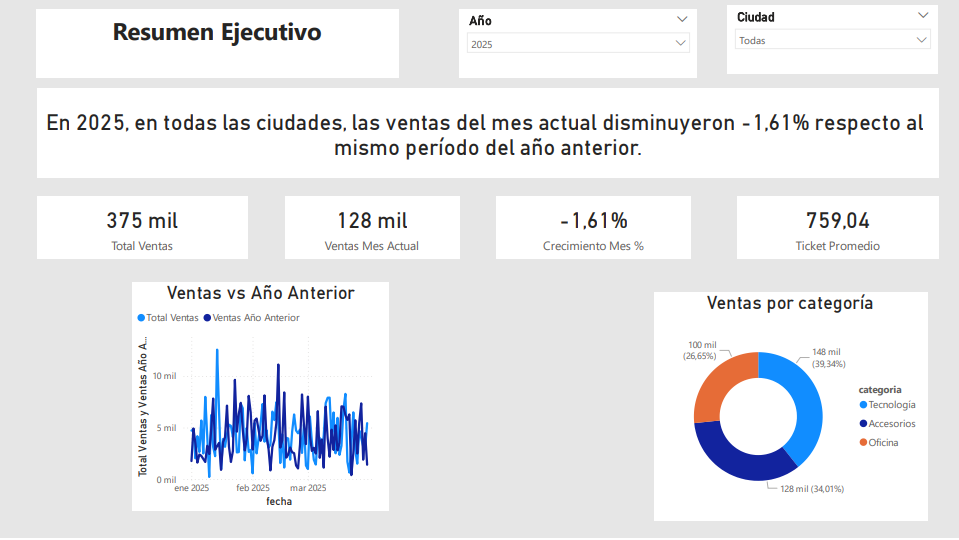
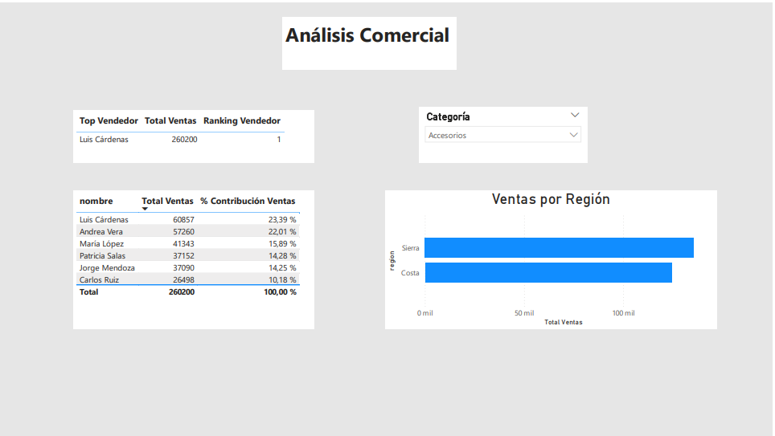
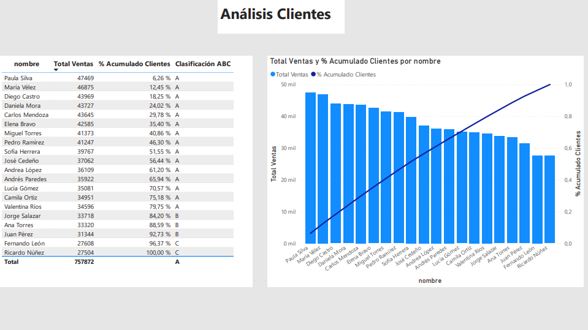

# 📊 Power BI Sales Analytics Dashboard

## 📌 Descripción

Este proyecto consiste en el desarrollo de un dashboard de Business Intelligence en Power BI orientado al análisis de ventas. El objetivo es simular un escenario real de negocio donde se analizan indicadores clave (KPIs), tendencias y segmentación de clientes para la toma de decisiones.

El dashboard permite evaluar el desempeño comercial, identificar patrones de comportamiento y priorizar clientes estratégicos mediante técnicas como análisis temporal y segmentación ABC.

---

## 🎯 Objetivos del Proyecto

* Analizar el comportamiento de ventas en el tiempo
* Comparar desempeño actual vs año anterior
* Identificar clientes y segmentos clave
* Aplicar técnicas de análisis como acumulados y Pareto (ABC)
* Construir un dashboard claro y orientado a negocio

---

## 🧱 Modelo de Datos

El modelo sigue un enfoque tipo estrella:

* **ventas**: transacciones (cantidad, precio_unitario, fecha)
* **clientes**: información de clientes (nombre, ciudad, región)
* **calendario**: dimensión de fechas
* **productos / categorías**: clasificación de ventas

Relaciones principales:

* ventas → clientes
* ventas → calendario
* ventas → productos

---

## 📊 KPIs Implementados

### 🔹 Total Ventas

Cálculo del total de ingresos:

```DAX
Total Ventas =
SUMX(
    ventas,
    ventas[cantidad] * ventas[precio_unitario]
)
```

---

### 🔹 Ventas Mes Actual (MTD)

```DAX
Ventas Mes Actual =
CALCULATE(
    [Total Ventas],
    DATESMTD(calendario[fecha])
)
```

---

### 🔹 Ventas Mes Año Anterior

```DAX
Ventas Mes LY =
CALCULATE(
    [Total Ventas],
    DATESMTD(
        SAMEPERIODLASTYEAR(calendario[fecha])
    )
)
```

---

### 🔹 Crecimiento (%)

```DAX
Crecimiento Mes % =
VAR Actual = [Ventas Mes Actual]
VAR Anterior = [Ventas Mes LY]
RETURN
IF(
    ISBLANK(Anterior),
    BLANK(),
    DIVIDE(Actual - Anterior, Anterior)
)
```

---

### 🔹 Ticket Promedio

```DAX
Ticket Promedio =
DIVIDE([Total Ventas], COUNTROWS(ventas))
```

---

## 🧠 Texto Dinámico (Insight automático)

```DAX
Texto KPI Crecimiento =
VAR Crecimiento = [Crecimiento Mes %]
VAR TextoPorcentaje = FORMAT(Crecimiento, "0.00%")
VAR Ciudad = SELECTEDVALUE(clientes[ciudad], "todas las ciudades")
VAR AnioSelect = SELECTEDVALUE(calendario[año])
RETURN
SWITCH(
    TRUE(),
    ISBLANK(Crecimiento),
        "No hay datos suficientes para comparar.",
    Crecimiento > 0,
        "En " & AnioSelect & ", en " & Ciudad & ", las ventas del mes actual crecieron " & TextoPorcentaje &
        " respecto al mismo período del año anterior.",
    Crecimiento < 0,
        "En " & AnioSelect & ", en " & Ciudad & ", las ventas del mes actual disminuyeron " & TextoPorcentaje &
        " respecto al mismo período del año anterior.",
    "Las ventas se mantienen iguales respecto al año anterior."
)
```

---

## 📈 Segmentación ABC de Clientes

### 🔹 % Acumulado

```DAX
% Acumulado Clientes =
VAR TotalGeneral =
    CALCULATE([Total Ventas], ALL(clientes))
VAR TablaBase =
    ADDCOLUMNS(
        ALL(clientes[nombre]),
        "Ventas", [Total Ventas]
    )
VAR VentasActual = [Total Ventas]
VAR VentasAcumuladas =
    SUMX(
        FILTER(
            TablaBase,
            [Ventas] >= VentasActual
        ),
        [Ventas]
    )
RETURN
DIVIDE(VentasAcumuladas, TotalGeneral)
```

---

### 🔹 Clasificación ABC

```DAX
Clasificación ABC =
SWITCH(
    TRUE(),
    [% Acumulado Clientes] <= 0.8, "A",
    [% Acumulado Clientes] <= 0.95, "B",
    "C"
)
```

---

## 📊 Visualizaciones Incluidas

### 🟢 Página 1: Resumen Ejecutivo

* KPIs principales
* Texto dinámico (insight)
* Ventas vs año anterior
* Ventas por categoría

### 🔵 Página 2: Análisis Comercial

* Ventas por vendedor
* Contribución por cliente
* Ventas por región

### 🟣 Página 3: Análisis de Clientes

* Segmentación ABC
* Gráfico Pareto
* Ranking de clientes

---

## 📌 Insights Clave

* Un pequeño grupo de clientes (A) concentra la mayor parte de las ventas
* El crecimiento se analiza comparando periodos equivalentes (MTD vs MTD LY)
* La segmentación permite priorizar estrategias comerciales

---

## 🛠 Herramientas Utilizadas

* Power BI
* DAX (Data Analysis Expressions)
* Modelado de datos

---

## 🚀 Posibles Mejoras

* Implementar métricas YTD
* Añadir segmentación por productos
* Integrar forecasting
* Optimizar UX/UI del dashboard

---

## 📷 Vista del dashboard





---
## 📎 Autor

Edgar Daza
Proyecto desarrollado como práctica de Business Intelligence orientada a portafolio profesional.
