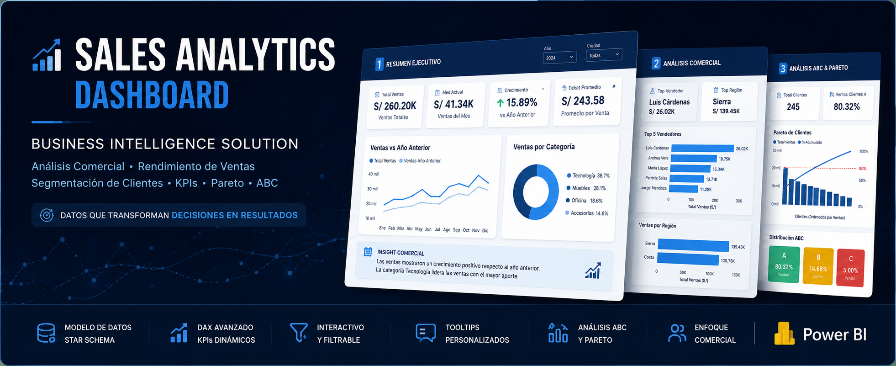
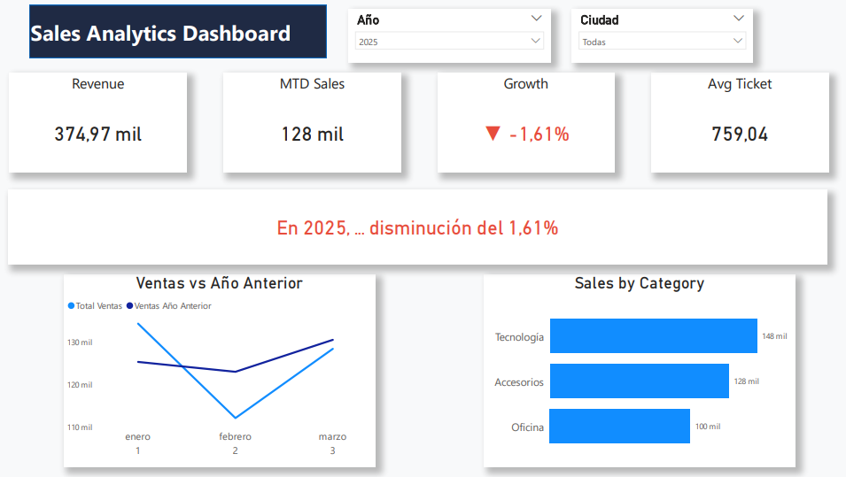
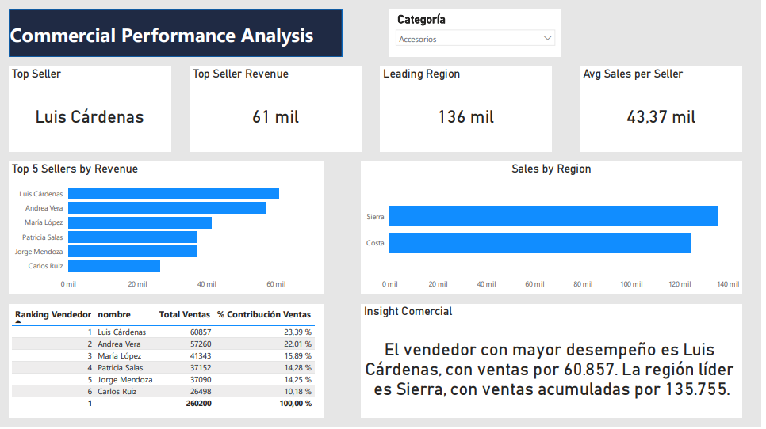
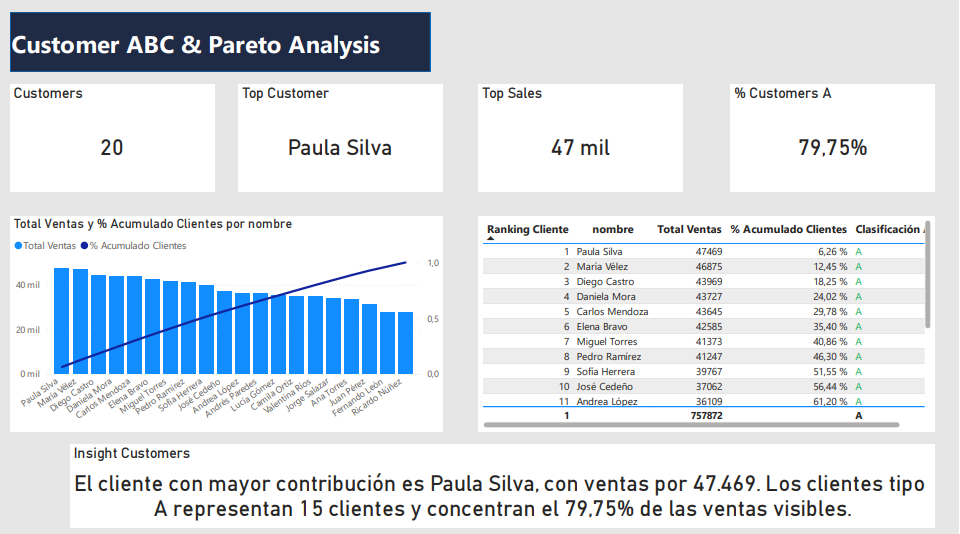

# Sales Analytics Dashboard – Power BI

## 📊 Solución de Business Intelligence para análisis comercial y toma de decisiones

Dashboard interactivo desarrollado en Power BI para el análisis de ventas, rendimiento comercial, segmentación de clientes y monitoreo de indicadores estratégicos.

La solución transforma datos transaccionales en información accionable mediante visualizaciones interactivas, KPIs dinámicos, análisis Pareto y segmentación ABC.

---

# 🚀 Descripción del proyecto

Muchas organizaciones gestionan sus ventas mediante archivos Excel o reportes dispersos, dificultando:

- El monitoreo del rendimiento comercial
- La identificación de productos y clientes estratégicos
- El análisis de tendencias de ventas
- La evaluación del desempeño de vendedores
- La toma de decisiones basada en datos

Este proyecto presenta una solución de Business Intelligence orientada a:

- Monitoreo de ingresos
- Análisis comercial
- Segmentación de clientes
- Análisis Pareto
- Comparación interanual de ventas
- Evaluación de desempeño regional y comercial

---

# 🧩 Estructura del Dashboard

La solución está compuesta por tres páginas analíticas.

---

## 1️⃣ Resumen Ejecutivo

Dashboard ejecutivo diseñado para monitoreo rápido del negocio.

### Funcionalidades

- KPI de ventas totales
- Ventas del mes actual
- Porcentaje de crecimiento
- Ticket promedio
- Insight dinámico automatizado
- Comparación ventas vs año anterior
- Ventas por categoría
- Filtros interactivos por año y ciudad

### Objetivo

Brindar una visión ejecutiva inmediata del comportamiento comercial.

---

## 2️⃣ Análisis Comercial

Página enfocada en el rendimiento del equipo comercial y análisis regional.

### Funcionalidades

- Identificación del mejor vendedor
- Ranking comercial
- Participación porcentual de ventas
- Comparación de ventas por región
- Filtro dinámico por categoría
- Indicadores comerciales interactivos

### Objetivo

Detectar oportunidades comerciales y evaluar el desempeño del equipo de ventas.

---

## 3️⃣ Análisis ABC y Pareto de Clientes

Análisis avanzado de clientes mediante metodología Pareto y clasificación ABC.

### Funcionalidades

- Clasificación ABC de clientes
- Análisis acumulado de ventas
- Gráfico Pareto
- Identificación de clientes estratégicos
- Insights dinámicos comerciales

### Objetivo

Priorizar clientes clave y optimizar estrategias comerciales.

---

# 📈 KPIs implementados

- Total Ventas
- Ventas Mes Actual
- Crecimiento %
- Ticket Promedio
- Top Vendedor
- Participación porcentual de ventas
- Clasificación ABC
- Porcentaje acumulado de clientes

---

# 🧠 Medidas DAX implementadas

El proyecto incluye medidas avanzadas desarrolladas en DAX:

- Time Intelligence
- Ranking dinámico
- Cálculos acumulados Pareto
- Segmentación ABC
- KPIs narrativos dinámicos
- Formato condicional
- Interacciones analíticas

---

# 🏗 Modelo de datos

El dashboard fue construido bajo una arquitectura tipo Star Schema, optimizando rendimiento y escalabilidad analítica.

## Tabla de hechos

- ventas

## Tablas dimensionales

- clientes
- productos
- vendedores
- calendario

## Beneficios del modelo

- Mejor rendimiento
- Escalabilidad
- Filtrado eficiente
- Flexibilidad analítica

---

# 🎨 Mejoras visuales implementadas

El dashboard fue rediseñado siguiendo principios modernos de UX/UI para Business Intelligence:

- Diseño ejecutivo
- KPIs profesionales
- Tooltips personalizados
- Interacciones dinámicas
- Paleta visual corporativa
- Mejor distribución visual
- Storytelling analítico

---

# 🛠 Tecnologías utilizadas

- Power BI Desktop
- DAX
- Power Query
- Modelado de datos
- Time Intelligence

---

# 📸 Vista previa del dashboard

## Resumen Ejecutivo



---

## Análisis Comercial



---

## Análisis ABC y Pareto



# 🎥 Demo del Dashboard

[Ver demostración del dashboard](https://youtu.be/F69u8eSWKCE)

---

# 📂 Estructura del repositorio

```plaintext
powerbi-SalesAnalytics-dashboard/
│
├── data/
│   └── ventas_dashboard.csv
│
├── reports/
│   ├── dashboard.pbix
│   └── image/
│       ├── dashboard1.png
│       ├── dashboard2.png
│       └── dashboard3.png
│
└── README.md
```

---

# 🎯 Aplicabilidad

Este tipo de solución puede adaptarse a:

- Empresas comerciales
- Retail
- Distribuidores
- Departamentos de ventas
- PYMES
- Empresas que trabajan con Excel

---

# 💡 Posibles mejoras futuras

- Forecasting de ventas
- Dashboards móviles
- Automatización de actualización
- Seguridad por roles (RLS)
- KPIs predictivos
- Drill-through avanzado

---

# ⭐ Aspectos destacados

- Dashboard ejecutivo profesional
- Business Intelligence interactivo
- DAX avanzado
- Storytelling analítico
- Segmentación ABC y Pareto
- Diseño orientado a negocio


---
## 📎 Autor

Edgar Daza

